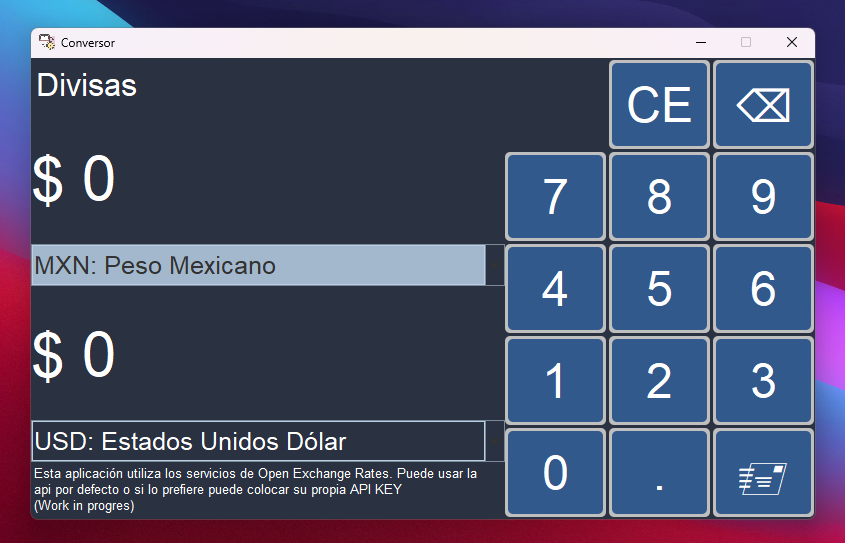
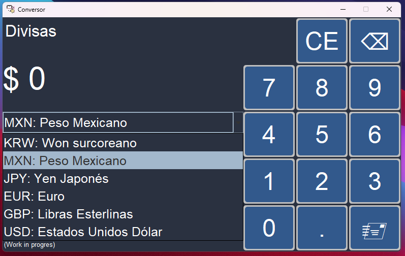
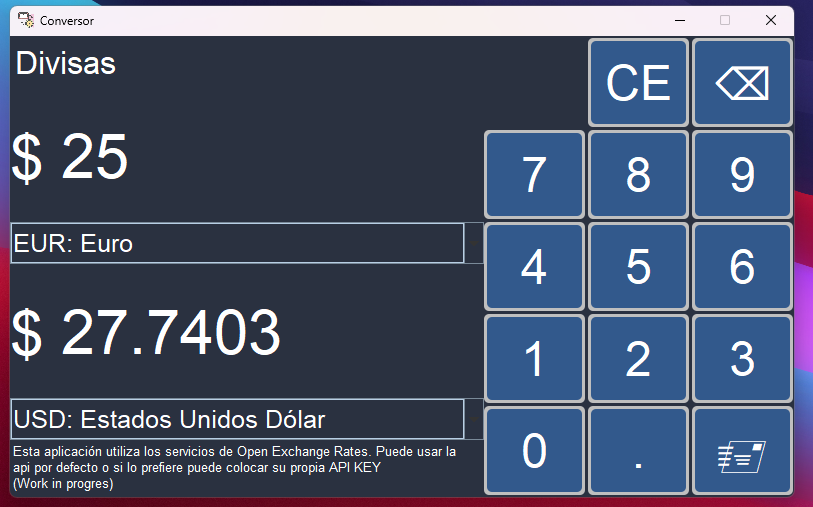
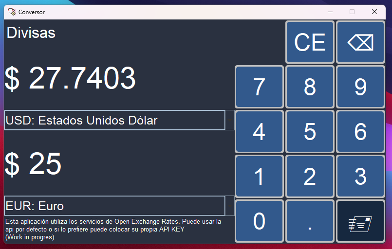

# Conversor Monedas en Java

Aplicación de cambio de monedas la cual te permite hacer uso de una API para consultar cambios en tiempo real
- Podrás:
  - Convertir a Dólar
  - Convertir a Euros
  - Convertir a Libras Esterlinas
  - Convertir a Yen Japonés
  - Convertir a Won surcoreano
  - Convertir a Peso Mexicano
## Capturas de pantalla

### Ejecutable
Dentro de la carpeta executable existe un archivo .jar para ejecutar directamente la aplicación
